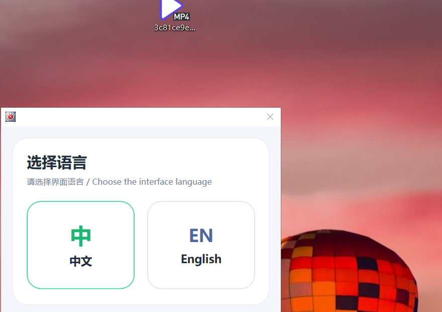
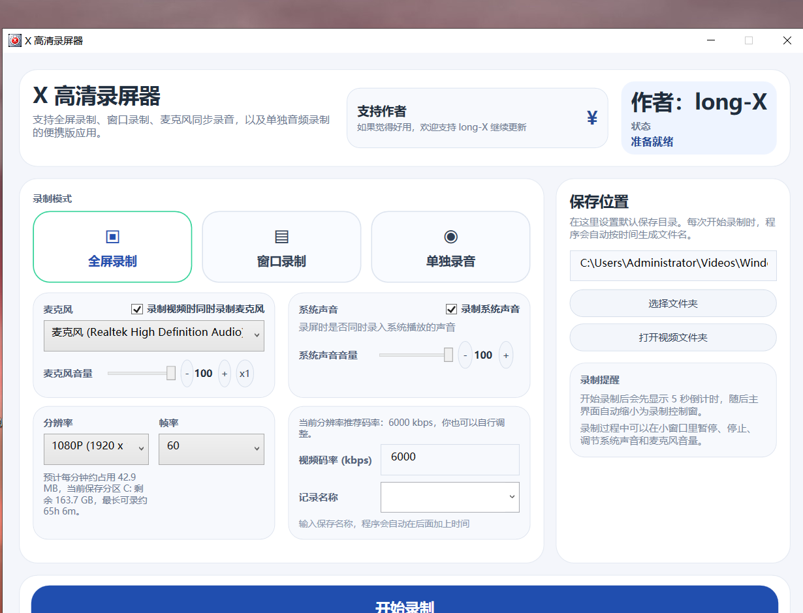
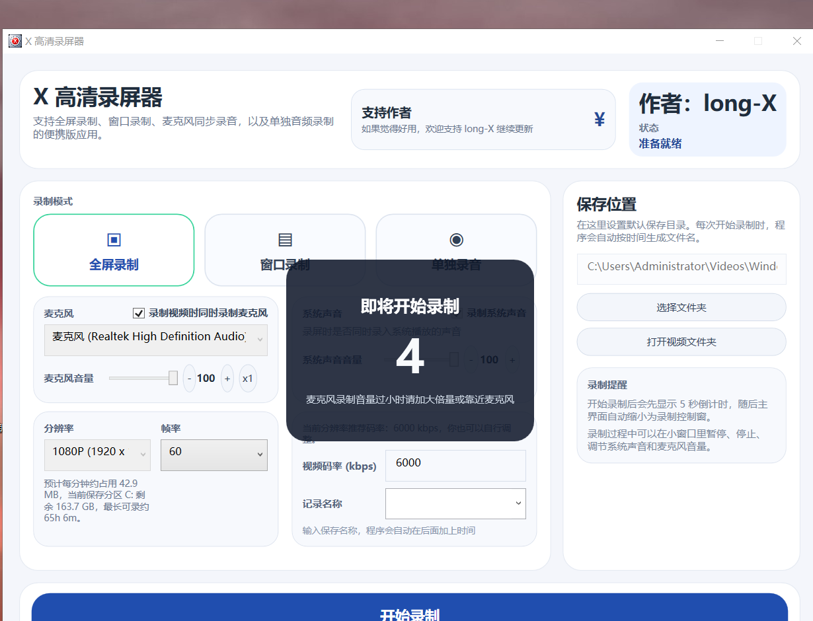
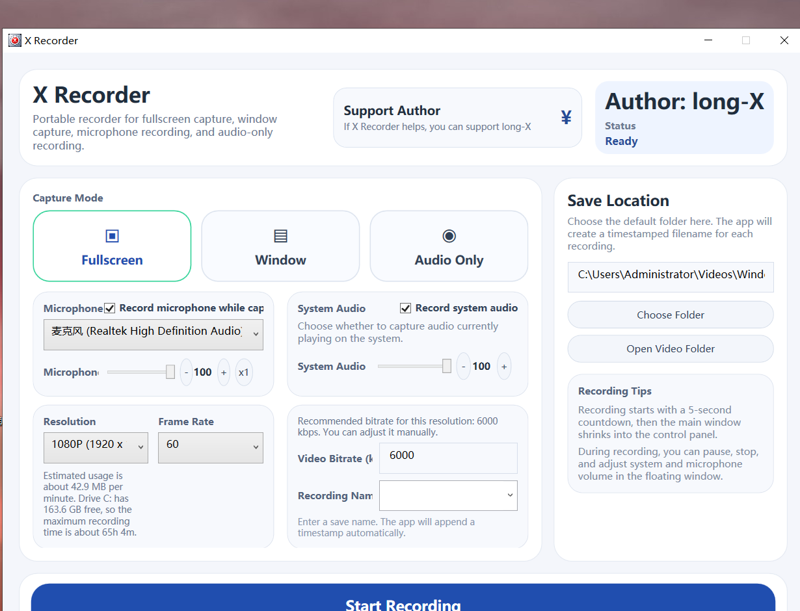
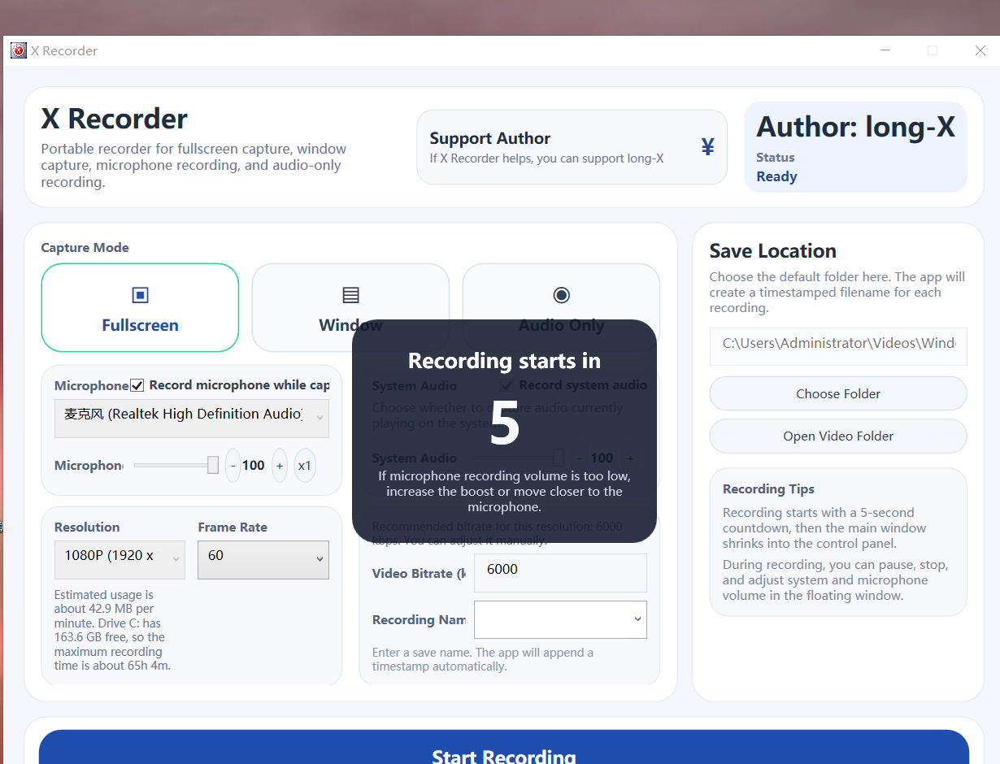

# X Recorder

`X Recorder` is an open-source Windows screen recorder for `Windows 10/11 64-bit`.

It is designed for people who want a simple desktop recorder with:
- Fullscreen recording
- Window recording
- Audio-only recording
- Microphone capture
- System audio capture
- Chinese / English interface

This project is free to use. If it helps you, you can support the author voluntarily inside the app.

## Download

Latest public release:
- [GitHub Releases](https://github.com/szxwl2-long/x-recorder-windows-screen-recorder/releases)

Recommended for most users:
- `X-Recorder-Setup.exe`

Portable version:
- `X-Recorder-Portable.zip`
- Important: extract and keep the full folder together
- Do **not** copy only `WindosRecorder.exe`

## Features

- Fullscreen recording
- Window recording
- Audio-only recording
- Microphone recording
- System audio recording
- 2K / 1080P / 720P / 480P presets
- Recommended bitrate autofill
- Save folder selection
- Recording name memory
- 5-second countdown before recording starts
- Compact recording control window
- Support / donation window
- Chinese / English UI

## System Requirements

- Windows 10 64-bit or Windows 11 64-bit
- Microphone if you want voice recording
- Graphics and audio environment supported by the current Windows system

## Notes Before Running

- This app is currently distributed as an unsigned Windows desktop application
- Windows SmartScreen may show a warning on first launch
- This app currently targets `Windows 10/11 x64` only
- Some recording failures can be caused by system policy, graphics drivers, audio devices, or missing media components

## Screenshots

Prepared cover image:
- [release-cover.png](WindosRecorder/Assets/release-cover.png)

Current screenshot set:

### Language Selection

### Chinese Main Screen

### Chinese Countdown

### English Main Screen

### English Countdown

Planning guide:
- [SCREENSHOT-PLAN.md](SCREENSHOT-PLAN.md)

## Open Source And Support

This project is open source under `GPL-3.0`.

You are welcome to:
- Use the software
- Study the code
- Modify the code
- Share changes under the same license terms

If `X Recorder` is useful to you, you can support the author voluntarily inside the app.

Author:
- `long-X`

## Known Limitations

- Windows code signing is not yet enabled for public release builds
- SmartScreen reputation is not yet established
- Public screenshots and marketing assets still need improvement

## Privacy

See [PRIVACY.md](PRIVACY.md).

## License

This project is licensed under the GNU General Public License v3.0.
See [LICENSE](LICENSE).

## Signing

See [SIGNING.md](SIGNING.md) for Windows code signing guidance and the included release-signing script.

## Release Metadata

See:
- [RELEASE-TEXT.md](RELEASE-TEXT.md)
- [PLATFORM-METADATA.md](PLATFORM-METADATA.md)
- [GITHUB-RELEASE-NOTES.md](GITHUB-RELEASE-NOTES.md)

## Development Notes

This repository is actively being prepared for wider public distribution.

Useful next steps:
- Add screenshots
- Improve release cover art
- Enable code signing
- Expand release notes over time
